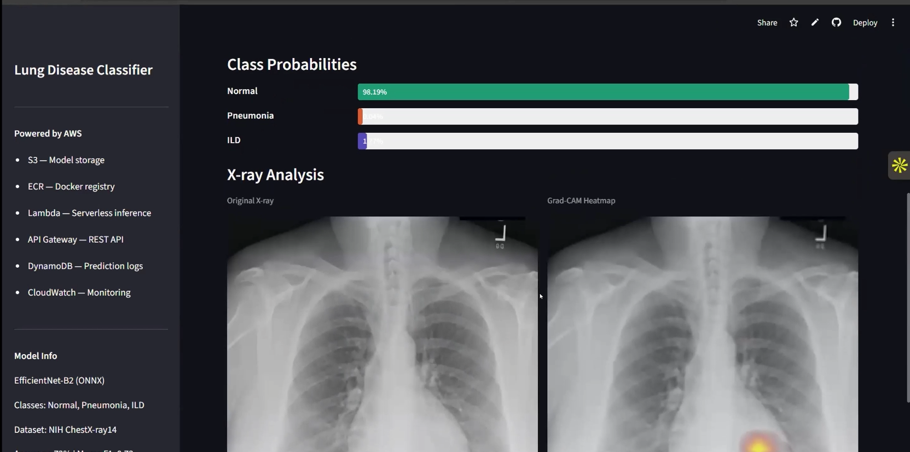
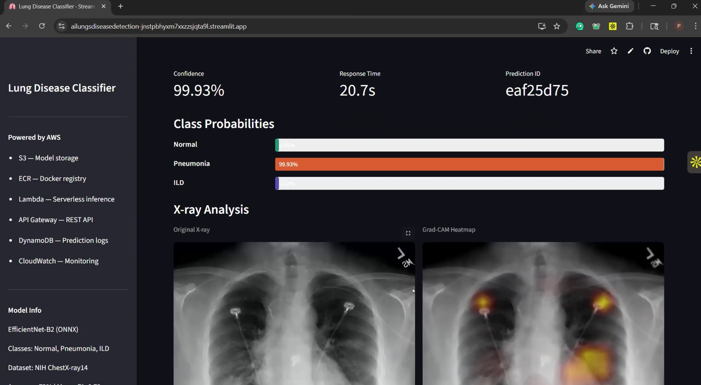
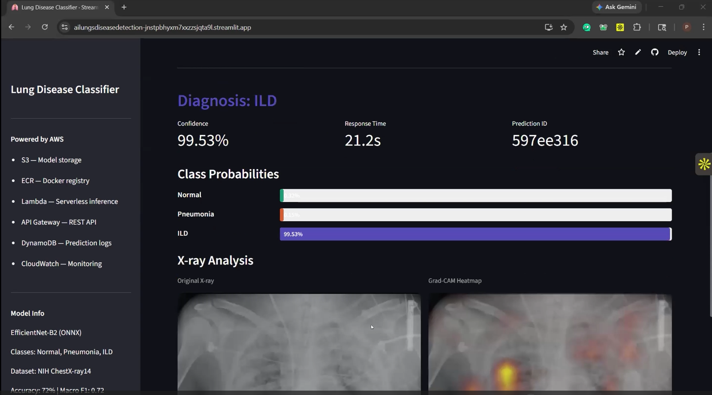
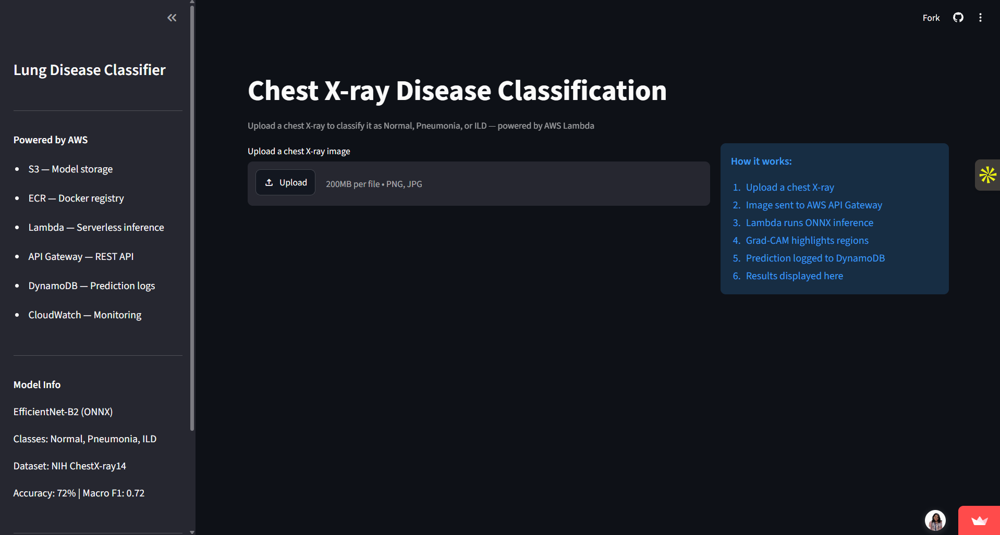
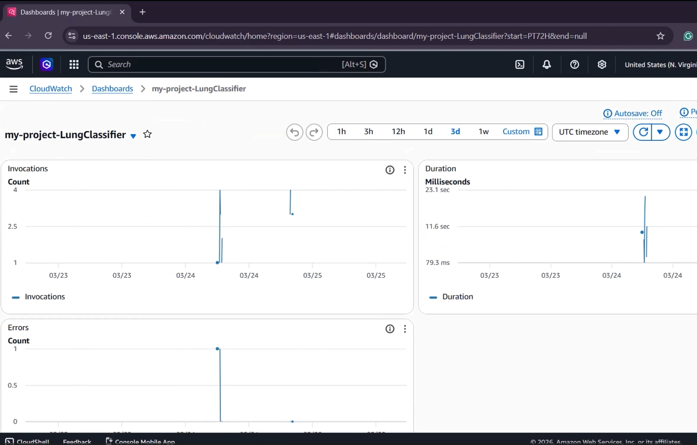

# Lung Disease Classification — Serverless Deep Learning on AWS

Classifies chest X-rays as **Normal**, **Pneumonia**, or **ILD** (interstitial lung disease) using an EfficientNet-B2 model, served through a fully serverless AWS pipeline. A user uploads an X-ray in a Streamlit dashboard, the image is sent to a containerized AWS Lambda running ONNX inference, and the result comes back with a confidence score and a Grad-CAM heatmap showing which lung regions drove the prediction.

The entire stack runs within the AWS free tier with no servers to manage.


## Why this exists

Chest X-rays are the most common imaging exam in the world, but reading them accurately takes years of radiologist training, and radiologists are in short supply in many regions. A fast, explainable AI second opinion can support clinical decisions. This project is a research and engineering demonstration of how such a model can be deployed cheaply and at scale. It is not a medical device and is not for clinical use.

## Architecture

```
X-ray upload (Streamlit)
        │  base64 image, POST
        ▼
   API Gateway  (REST API, POST /predict)
        │
        ▼
   AWS Lambda  (container image from ECR, 1024 MB)
        │   - loads model.onnx from S3
        │   - preprocesses image, runs EfficientNet-B2 inference
        │   - generates Grad-CAM heatmap
        ├──────────────▶  S3        (model + heatmap storage)
        └──────────────▶  DynamoDB  (prediction history)
        │
        ▼
   CloudWatch  (invocations, latency, errors)
```

| Service | Role |
|---|---|
| **S3** | Stores `model.onnx` and generated Grad-CAM heatmaps |
| **Lambda** | Serverless inference, packaged as a Docker container via ECR |
| **ECR** | Hosts the Lambda container image (ONNX Runtime based) |
| **API Gateway** | REST API exposing `POST /predict` |
| **DynamoDB** | Prediction history: class, confidence, timestamp, filename |
| **CloudWatch** | Monitoring: invocation count, inference latency, errors |
| **IAM** | Least-privilege role scoped to the `results/*` prefix |

See [docs/ARCHITECTURE.md](docs/ARCHITECTURE.md) for the full build, phase by phase.

## The model

- **Backbone:** EfficientNet-B2 pretrained on ImageNet, fine-tuned for 3-class chest X-ray classification
- **Data:** NIH ChestX-ray14 subset, 5,307 images across Normal, Pneumonia, and ILD
- **Class imbalance:** Pneumonia had only 307 images versus ~2,500 each for Normal and ILD. Handled by balancing every class to 2,000 samples at the file level (downsampling the majority classes, oversampling Pneumonia) plus a `WeightedRandomSampler` during training
- **Training:** PyTorch, AdamW, early stopping (patience 10), aggressive augmentation (random crop, rotation, color jitter, affine, random erasing)
- **Export:** PyTorch → ONNX (opset 17) to cut the container from ~1.5 GB of PyTorch dependencies down to a lightweight ONNX Runtime image that fits the ECR free tier
- **Explainability:** Grad-CAM saliency maps generated from a convolutional layer, overlaid on the original X-ray to show which lung regions drove the prediction

See [notebooks/lungs_disease_detection.ipynb](notebooks/lungs_disease_detection.ipynb) for training and export.

## Results

- Validation accuracy: **72%**
- Macro F1: **0.72**
- Sample inference latency (warm Lambda): ~10–12 s end to end (cold start adds 2–4 s)

The train/validation split is done before any oversampling, so the minority-class oversampling applies to training data only and does not leak into validation. A confusion matrix and full classification report are in [docs/RESULTS.md](docs/RESULTS.md).

## Repo structure

```
.
├── notebooks/
│   └── lungs_disease_detection.ipynb   # training + ONNX export
├── lambda_function/
│   ├── handler.py                      # inference handler (reference)
│   └── Dockerfile                      # ONNX Runtime container
├── streamlit_app/
│   └── app.py                          # dashboard (reference)
├── docs/
│   ├── ARCHITECTURE.md                 # full AWS build
│   └── RESULTS.md                      # metrics + confusion matrix
├── assets/                             # screenshots
└── README.md
```

## Running it yourself

The training notebook runs in Google Colab or any GPU environment with PyTorch and torchvision. The AWS deployment is documented step by step in [docs/ARCHITECTURE.md](docs/ARCHITECTURE.md).

## Example predictions

One example per class from the live app. Percentages are the model's per-image confidence (softmax) for that prediction, not overall accuracy. Overall validation accuracy is 72% (macro F1 0.72), see [docs/RESULTS.md](docs/RESULTS.md).

| Class | Example |
|---|---|
| **Normal** (98.19% confidence) |  |
| **Pneumonia** (99.93% confidence) |  |
| **ILD** (99.53% confidence) |  |

## System

| | |
|---|---|
|  |  |
| Landing page and AWS pipeline overview | CloudWatch dashboard: invocations, duration, errors |

## Limitations

- **Not for clinical use.** Research and engineering demo only. Real deployment would require FDA clearance and clinical validation.
- **Cold starts.** The first Lambda invocation after idle adds 2–4 seconds.
- **Approximate explainability.** Grad-CAM highlights regions that influenced the prediction but is not a clinical localization of pathology.
- **Small dataset.** 5,307 images. The Pneumonia class had only 307 real images and was oversampled in training, so real-world generalization would need far more data.

## Acknowledgements

Built as the final project for ITC 6460 (Cloud Analytics) at Northeastern University. NIH ChestX-ray14 dataset courtesy of the NIH Clinical Center.
